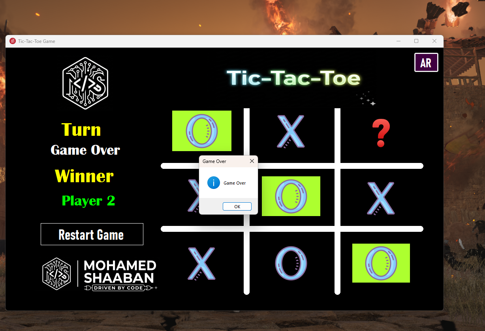
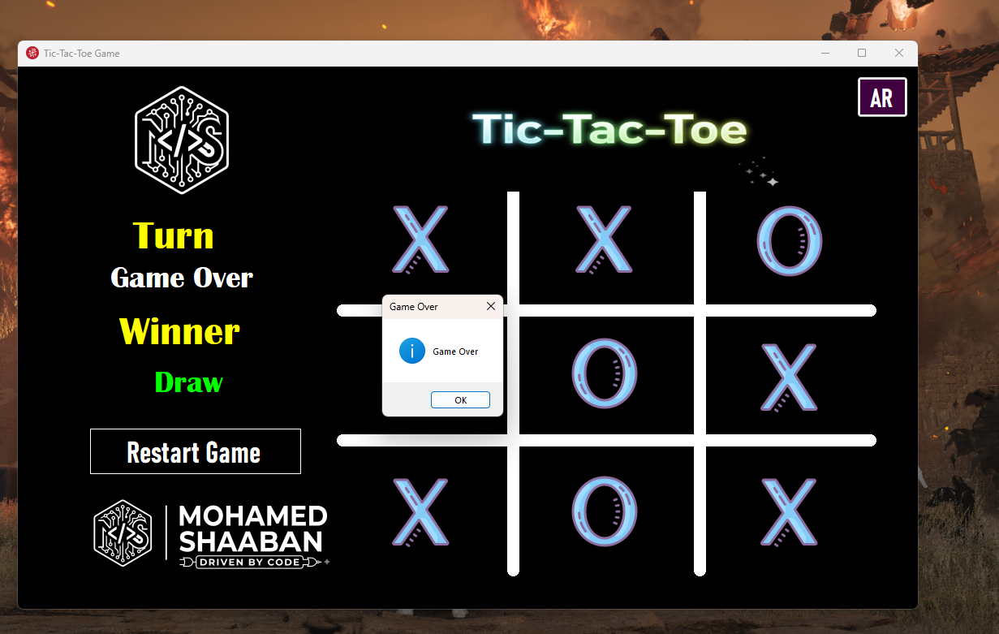
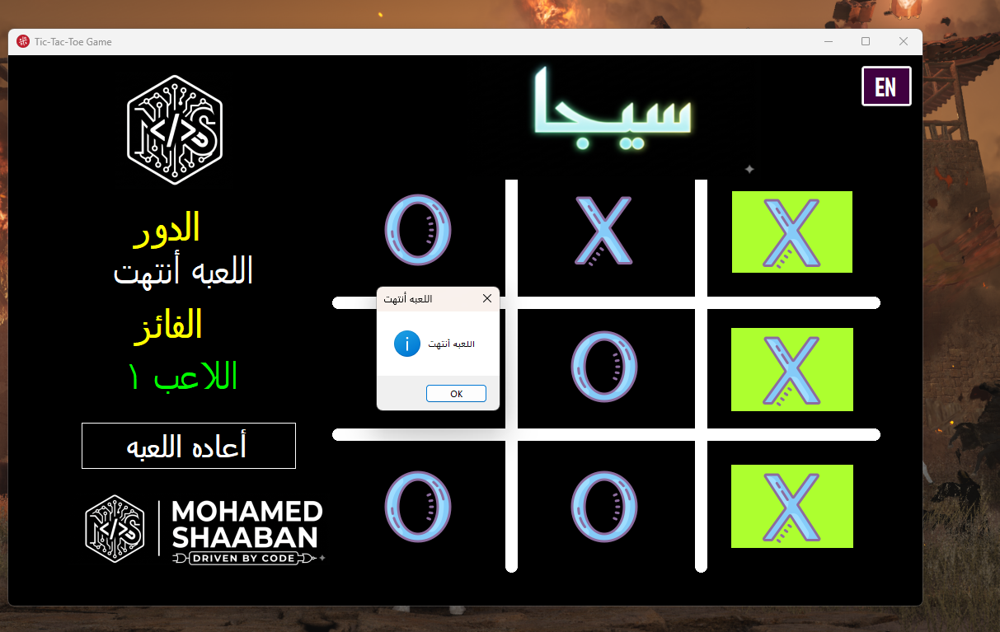

# Tic Tac Toe Game

## 📌 Project Overview

Tic Tac Toe Game is a Windows Forms application that supports both Arabic and English languages.

The game allows players to enjoy the classic Tic Tac Toe gameplay in their preferred language, with different modes for single player or two players.

This project was built as part of practical training while studying desktop application development.

---

<<<<<<< HEAD
## 🏗 System Architecture

This is a **Single Tier Architecture** application:
1. **Presentation Layer**
   * Windows Forms UI
   * Game board display
   * Player interaction
2. **Application Logic**
   * Game rules
   * Win/draw detection
   * Turn management
3. **Data Storage**
   * None (client-side game)
   * Configuration settings

---

=======
>>>>>>> 8cd4d7a4de31c05664623c9bfa8255cdeea0bfcb
## 🛠 Technologies Used

* C#
* .NET Framework – Windows Forms
* XML (for language files)
* Visual Studio

---

## ✨ System Features

### 🎮 Game Modes

* Two Player (Player vs Player)
* Arabic and English language support

### 🎯 Gameplay

* Classic Tic Tac Toe rules
* Win detection algorithm
* Draw detection
* Turn-based gameplay

### 🌐 Language Support

* Arabic language interface
* English language interface
* Language switching functionality

---

<<<<<<< HEAD
=======
## ⚙️ Installation & Setup 

1️⃣ Clone the repository

```bash
git clone https://github.com/ss24214859/Course-Abu-Hadhoud.git
```

2️⃣ Open the solution file in Visual Studio.

3️⃣ Build and run the project.

4️⃣ Select your preferred language and enjoy the game!

---

>>>>>>> 8cd4d7a4de31c05664623c9bfa8255cdeea0bfcb
## 📷 Screenshots

### 🎮 English - Player 1 Wins



### 🎮 English - Draw



### 🎮 Arabic - Player 1 Wins



---

## ⚙️ Installation & Setup

1️⃣ Clone the repository

```bash
git clone https://github.com/ss24214859/Tic-Tac-Toe-Arabic-And-Enlish.git
```

2️⃣ Open the solution file in Visual Studio.

3️⃣ Build and run the project.

4️⃣ Select your preferred language and enjoy the game!

---

## 🚀 Future Enhancements

* AI opponent with different difficulty levels
* Custom board size options
* Save and load game progress
* Sound effects
* High score tracking
* Dark/Light theme support

---

## 👨‍💻 Author

**Mohamed Shaaban**

* GitHub: [https://github.com/ss24214859](https://github.com/ss24214859)

---

## 📜 License

This project is for learning purposes and training.
